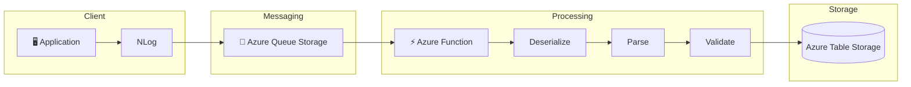

# logs_viewer

# 🚀 Azure Log Processing Pipeline

---

# 📖 Overview

This project demonstrates a complete **event-driven log processing pipeline** built with Azure technologies.

The solution simulates a production environment where application logs are generated, queued, processed asynchronously, and stored for later analysis.

Although it runs locally using **Azurite**, the architecture is designed to be easily migrated to Azure with minimal configuration changes.

This repository was created as part of my journey toward becoming an **Azure Solutions Architect**, showcasing cloud-native development practices and serverless architecture.

---

# 🎯 Objectives

* Demonstrate event-driven architecture.
* Practice Azure Functions development.
* Simulate Azure Storage locally using Azurite.
* Process logs asynchronously.
* Store structured log data.
* Build a production-ready portfolio project.

---

# 🏗 Architecture

## C1 Context Diagram

    

## C2 Container Diagram

    

## C3 LogWorkerMaker Diagram

    

## C3 App Function Diagram

    

---

# ⚙️ Technologies

| Technology             | Purpose                      |
| ---------------------- | ---------------------------- |
| .NET 8                 | Application Platform         |
| Azure Functions        | Event Processing             |
| Azure Queue Storage    | Message Queue                |
| Azure Table Storage    | Structured Storage           |
| Azurite                | Local Azure Storage Emulator |
| NLog                   | Logging Framework            |
| Docker                 | Local Infrastructure         |
| Visual Studio 2026     | Development                  |
| Visual Studio Code     | Development                  |
| Azure Storage Explorer | Storage Inspection           |

---

# 📂 Solution Structure

---

## 🔄 Processing Flow

---

# ✨ Features

* Event-driven processing
* Asynchronous architecture
* Local Azure Storage simulation
* Queue Trigger Azure Functions
* Structured log persistence
* Dependency Injection
* Configuration via appsettings.json
* Ready for Azure deployment
* Easily extensible

---

# 🧠 Architecture Decisions

## Why Queue Storage?

Using queues decouples the producer from the consumer.

Benefits:

* Higher scalability
* Improved resilience
* Retry capabilities
* Better fault tolerance

---

## Why Azure Functions?

Azure Functions provide:

* Serverless execution
* Automatic scaling
* Pay-per-execution model
* Minimal infrastructure management

---

## Why Table Storage?

Structured logs do not require relational joins.

Table Storage offers:

* Low cost
* High performance
* Excellent scalability
* Simple querying
