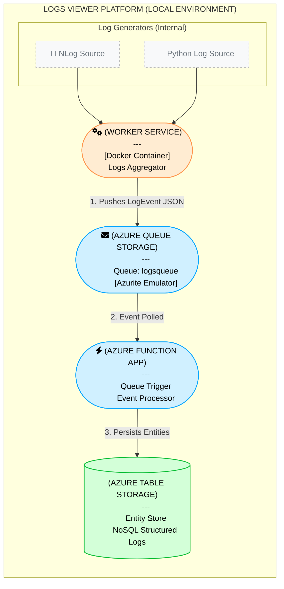
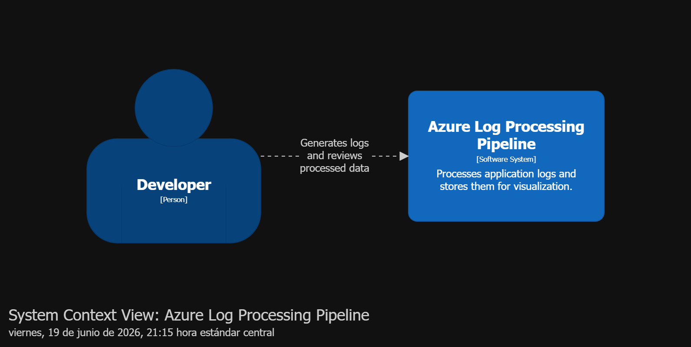
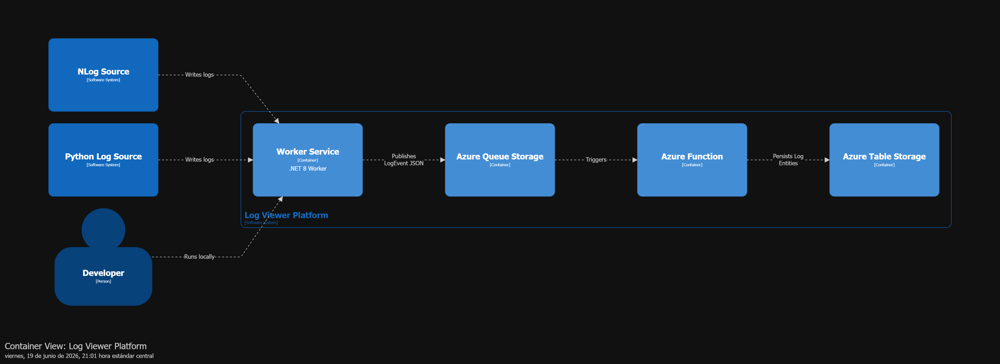
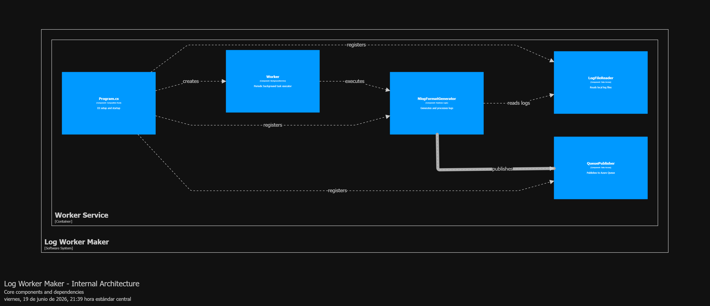
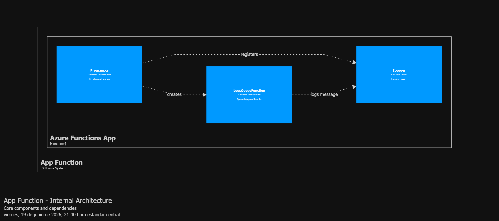
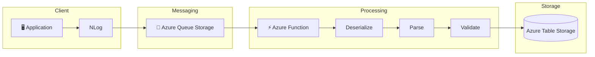

# logs_viewer

# 🚀 Azure Log Processing Pipeline

[](https://dotnet.microsoft.com/)
[](https://azure.microsoft.com/products/functions)
[](https://azure.microsoft.com/products/storage)
[](https://learn.microsoft.com/azure/storage/common/storage-use-azurite)
[](LICENSE)
[](https://github.com/quirosmirandavictor/logs_viewer/actions/workflows/appfunction-dev-ci.yml)
[](https://github.com/quirosmirandavictor/logs_viewer/actions/workflows/logworkermaker-dev-ci.yml)

---

# 📖 Overview

This project demonstrates a complete **event-driven log processing pipeline** built with Azure technologies.

The solution simulates a production environment where application logs are generated, queued, processed asynchronously, and stored for later analysis.

Although it runs locally using **Azurite**, the architecture is designed to be easily migrated to Azure with minimal configuration changes.

This repository was created as part of my journey toward becoming an **Azure Solutions Architect**, showcasing cloud-native development practices and serverless architecture.

---

# ⚡ Quick Start

Run the full local pipeline (Azurite + Worker + Function) with Docker.

Persistent mode (recommended for observability history):

```bash
cd docker
docker compose up --build -d
```

Fresh mode (start from zero on each run):

```bash
cd docker
docker compose -f docker-compose.yml -f docker-compose.fresh.yml up --build -d --force-recreate
```

Verify containers are running:

```bash
docker compose ps
```

Open Azure Storage Explorer and attach to the local emulator, then check:

* Queue: `logsqueue`
* Table: `Logs`

Follow runtime logs:

```bash
docker compose logs -f logworkermaker
docker compose logs -f appfunction
```

Stop services:

```bash
docker compose down
```

Delete persisted Azurite volume (hard reset):

```bash
docker compose down -v
```

---

# 🎯 Objectives

* Demonstrate event-driven architecture.
* Practice Azure Functions development.
* Simulate Azure Storage locally using Azurite.
* Process logs asynchronously.
* Store structured log data.
* Build a production-ready portfolio project.

---

# 🏗 Architecture


## C1 Context Diagram

<p align="center">
    
</p>

## C2 Container Diagram

<p align="center">
    
</p>

## C3 LogWorkerMaker Diagram

<p align="center">
    
</p>

## C3 App Function Diagram

<p align="center">
    
</p>

---

# ⚙️ Technologies

| Technology             | Purpose                      |
| ---------------------- | ---------------------------- |
| .NET 8                 | Application Platform         |
| Azure Functions        | Event Processing             |
| Azure Queue Storage    | Message Queue                |
| Azure Table Storage    | Structured Storage           |
| Azurite                | Local Azure Storage Emulator |
| NLog                   | Logging Framework            |
| Docker                 | Local Infrastructure         |
| Visual Studio 2026     | Development                  |
| Visual Studio Code     | Development                  |
| Azure Storage Explorer | Storage Inspection           |

---

# 📂 Solution Structure

```text
LOGS_VIEWER/

│
├── src/
│   ├── AppFunction/                        # Azure Function (queue trigger, table persistence)
│   ├── AppFunction.UnitTests/              # Unit tests for AppFunction
│   ├── AppFunction.IntegrationTests/       # Integration tests for AppFunction (Azurite)
│   │
│   └── worker/
│       ├── LogWorkerMaker/                 # Worker service (log reader, queue publisher)
│       ├── LogWorkerMaker.UnitTests/       # Unit tests for LogWorkerMaker
│       └── LogWorkerMaker.IntegrationTests/# Integration tests for LogWorkerMaker (Azurite)
│
├── docker/
│   └── docker-compose.fresh.yml
│   └── docker-compose.yml
│
├── docs/
│   ├── adr/                                # Architecture Decision Records
│   ├── diagrams/
│   ├── github-actions/                     # Documentation copies of CI workflow files
│   └── nfr/                                # Non-Functional Requirements
│
├── .github/
│   └── workflows/                          # Executable GitHub Actions CI workflows
│
├── README.md
└── LICENSE
```

---

## 🔄 Processing Flow



---

# ✨ Features

* Event-driven processing
* Asynchronous architecture
* Local Azure Storage simulation
* Queue Trigger Azure Functions
* Structured log persistence
* Dependency Injection
* Configuration via appsettings.json
* Ready for Azure deployment
* Easily extensible

---

# 🧠 Architecture Decisions

## Why Queue Storage?

Using queues decouples the producer from the consumer.

Benefits:

* Higher scalability
* Improved resilience
* Retry capabilities
* Better fault tolerance

---

## Why Azure Functions?

Azure Functions provide:

* Serverless execution
* Automatic scaling
* Pay-per-execution model
* Minimal infrastructure management

---

## Why Table Storage?

Structured logs do not require relational joins.

Table Storage offers:

* Low cost
* High performance
* Excellent scalability
* Simple querying

ADR index: [docs/adr/index.md](docs/adr/index.md)

---

# 🔁 CI Pipelines (GitHub Actions)

This repository includes separate CI pipelines for each .NET project, both configured for the `dev` branch.

Workflows:

* AppFunction: [.github/workflows/appfunction-dev-ci.yml](.github/workflows/appfunction-dev-ci.yml)
* LogWorkerMaker: [.github/workflows/logworkermaker-dev-ci.yml](.github/workflows/logworkermaker-dev-ci.yml)

Documentation copies:

* [docs/github-actions/appfunction-dev-ci.yml](docs/github-actions/appfunction-dev-ci.yml)
* [docs/github-actions/logworkermaker-dev-ci.yml](docs/github-actions/logworkermaker-dev-ci.yml)

Each pipeline runs:

1. `dotnet restore`
2. `dotnet test` (unit tests)
3. `dotnet test` (integration tests using Azurite)
4. Upload test and coverage artifacts
5. `dotnet clean`
6. `dotnet build`

Integration tests are executed on every push and pull request to `dev`.

## Run Tests Locally

AppFunction tests:

```bash
dotnet test src/AppFunction.UnitTests/AppFunction.UnitTests.csproj
dotnet test src/AppFunction.IntegrationTests/AppFunction.IntegrationTests.csproj
```

LogWorkerMaker tests:

```bash
dotnet test src/worker/LogWorkerMaker.UnitTests/LogWorkerMaker.UnitTests.csproj
dotnet test src/worker/LogWorkerMaker.IntegrationTests/LogWorkerMaker.IntegrationTests.csproj
```

Integration tests require Azurite running on local default ports (`10000`, `10001`, `10002`).

## Coverage for Portfolio Quality

Coverage reporting is relevant for this repository because it is part of an architecture portfolio.

It provides objective evidence that core processing flows are verified, including:

* Queue message parsing and validation
* Table Storage persistence behavior
* Worker publishing behavior for different log sources

The CI pipelines collect coverage data for unit and integration test runs and upload it as workflow artifacts.

At this stage, coverage is informative (no minimum gate enforced yet), which helps keep delivery fast while still making quality visible.

---

# 🐳 Local Container Setup and Validation

This section explains the required dependencies and how to run the full pipeline in Docker so you can validate Queue Storage and Table Storage behavior with Azure Storage Explorer.

## Prerequisites

* Docker Desktop (running, Linux containers mode enabled)
* Docker Compose v2 (included with Docker Desktop)
* Azure Storage Explorer

Optional for source-level local development (not required to run containers):

* .NET SDK 8 and .NET SDK 10 preview

## Services Started by Docker Compose

The compose file in [docker/docker-compose.yml](docker/docker-compose.yml) starts these containers:

* azurite: local emulator for Blob, Queue, and Table
* logworkermaker: generates and publishes log events to Queue Storage
* appfunction: Azure Functions isolated worker that consumes queue messages and writes entities to Table Storage

Message generation cadence in LogWorkerMaker:

* By default, the worker delay is controlled by DelaySeconds in [src/worker/LogWorkerMaker/appsettings.json](src/worker/LogWorkerMaker/appsettings.json).
* Current default value: 120 seconds.
* You can override it with the DelaySeconds environment variable in Docker Compose.

Fresh-start override file:

* [docker/docker-compose.fresh.yml](docker/docker-compose.fresh.yml): runs Azurite in temporary in-memory storage (`tmpfs`) so Queue/Table start empty

Exposed ports:

* 10000 Blob endpoint (Azurite)
* 10001 Queue endpoint (Azurite)
* 10002 Table endpoint (Azurite)
* 7071 Function host

## Start the Project in Containers

From the repository root:

```bash
cd docker
docker compose up --build -d
```

Start from zero (fresh Queue/Table without using persisted volume):

```bash
cd docker
docker compose -f docker-compose.yml -f docker-compose.fresh.yml up --build -d --force-recreate
```

Check container status:

```bash
docker compose ps
```

Follow logs:

```bash
docker compose logs -f logworkermaker
docker compose logs -f appfunction
```

Stop everything:

```bash
docker compose down
```

To also delete Azurite persisted data volume:

```bash
docker compose down -v
```

Recommended workflow for your next observability dashboard stage:

* Use persistent mode during normal development to accumulate historical records in table `Logs`.
* Use fresh mode when you need clean test runs and deterministic validations.

## Validate Queue and Table with Azure Storage Explorer

1. Open Azure Storage Explorer.
2. Select Add an account.
3. Select Attach to a local emulator.
4. Connect using default Azurite local endpoints.
5. Expand Local and Attached > Storage Accounts > Emulator - Default Ports.
6. Open Queues and inspect logsqueue.
7. Open Tables and inspect Logs.

Expected behavior while containers are running:

* logworkermaker continuously publishes messages to logsqueue.
* appfunction consumes messages from logsqueue.
* Table Logs is created automatically (if missing) and receives entities.
* Queue depth may fluctuate or stay low if consumption keeps up with production.

## Troubleshooting

* If docker compose commands fail with Docker API or engine pipe errors, start Docker Desktop first and retry.
* If you do not see new entities in Logs, check container logs for appfunction and verify Azurite is healthy.
